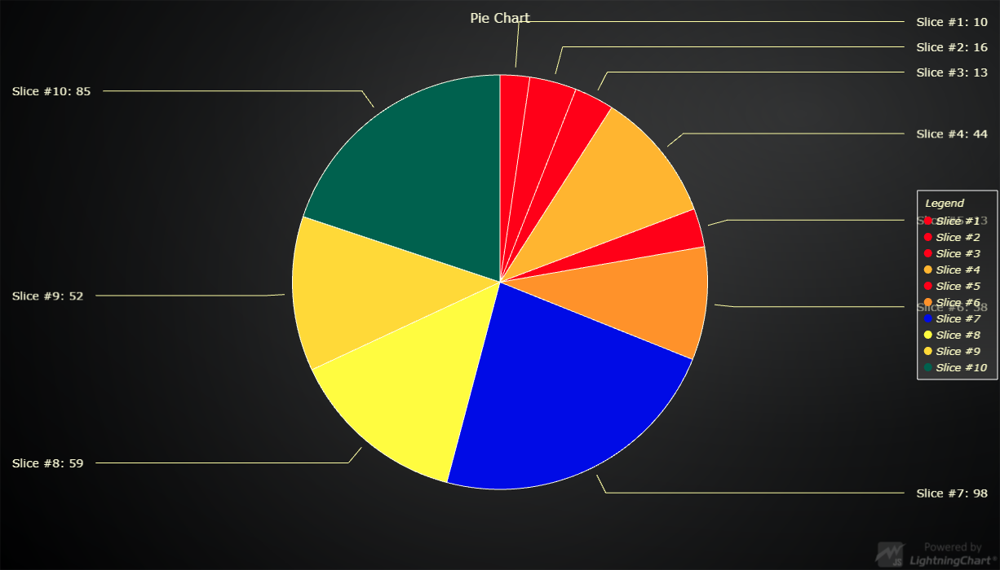

# Pie Chart with Lookup table



This demo application belongs to the set of examples for LightningChart JS, data visualization library for JavaScript.

LightningChart JS is entirely GPU accelerated and performance optimized charting library for presenting massive amounts of data. It offers an easy way of creating sophisticated and interactive charts and adding them to your website or web application.

The demo can be used as an example or a seed project. Local execution requires the following steps:

- Make sure that relevant version of [Node.js](https://nodejs.org/en/download/) is installed
- Open the project folder in a terminal:

        npm install              # fetches dependencies
        npm start                # builds an application and starts the development server

- The application is available at *http://localhost:8080* in your browser, webpack-dev-server provides hot reload functionality.


## Description

Lookup table stores information about values and its associated colors. It provides efficient lookup of the color based on provided value as well as linear and step interpolation between colors.

The current example shows usage of lookup table with a Pie Chart.

```javascript
// create LUT from 0..120 with gradient steps.
const lut = new LUT( {
    steps: [
        { value: 20, color: ColorRGBA( 255, 0, 24 ) },
        { value: 40, color: ColorRGBA( 255, 165, 44 ) },
        { value: 60, color: ColorRGBA( 255, 255, 65 ) },
        { value: 80, color: ColorRGBA( 0, 128, 24 ) },
        { value: 100, color: ColorRGBA( 0, 0, 249 ) },
        { value: 120, color: ColorRGBA( 134, 0, 125 ) }
    ],
    interpolate: true
} 
```

Create a Pie Chart and attach lookup table to fill the slices with colors based on value.

```javascript
// Create a new Pie Chart
const chart = lightningChart()
    .Pie({ type: PieChartTypes.LabelsOnSides })
    .setAnimationsEnabled( true )
    .setMultipleSliceExplosion( true )
    .setLabelFormatter( SliceLabelFormatters.NamePlusValue )
    .setSliceSorter( SliceSorters.None )
    // Attach lookup table.
    .setLUT( lut )
    .setLabelConnectorGap( 10 )

```


## API Links

* [Pie chart]
* [Pie Slice label formatter]
* [Lookup table]


## Support

If you notice an error in the example code, please open an issue on [GitHub][0] repository of the entire example.

Official [API documentation][1] can be found on [Arction][2] website.

If the docs and other materials do not solve your problem as well as implementation help is needed, ask on [StackOverflow][3] (tagged lightningchart).

If you think you found a bug in the LightningChart JavaScript library, please contact support@arction.com.

Direct developer email support can be purchased through a [Support Plan][4] or by contacting sales@arction.com.

[0]: https://github.com/Arction/
[1]: https://www.arction.com/lightningchart-js-api-documentation/
[2]: https://www.arction.com
[3]: https://stackoverflow.com/questions/tagged/lightningchart
[4]: https://www.arction.com/support-services/

© Arction Ltd 2009-2020. All rights reserved.


[Pie chart]: https://www.arction.com/lightningchart-js-api-documentation/v2.1.0/classes/piechart.html
[Pie Slice label formatter]: https://www.arction.com/lightningchart-js-api-documentation/v2.1.0/globals.html#slicelabelformatter
[Lookup table]: https://www.arction.com/lightningchart-js-api-documentation/v2.1.0/classes/lut.html

